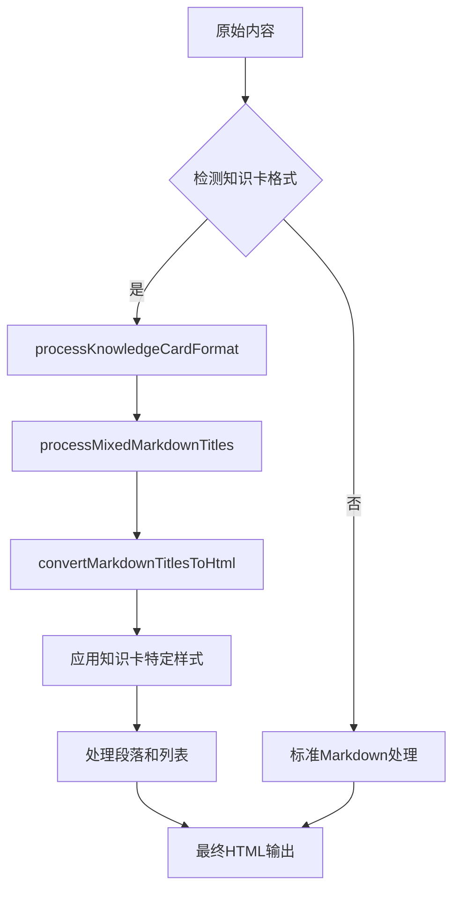

# 知识卡Markdown格式标题转换解决方案

## 问题描述

在知识卡展示过程中，Coze API按照`outputformat.md`的格式规范输出内容，其中包含大量的Markdown格式标题（如`##`、`####`等），这些标题在HTML中显示为原始Markdown符号，而不是正确的HTML标题格式。

## 解决方案

### 1. 核心函数

#### `convertMarkdownTitlesToHtml(content: string)`
- **功能**: 将标准Markdown标题转换为HTML标题
- **支持**: H1-H6所有级别的标题
- **样式**: 使用TailwindCSS类名，符合知识卡设计规范

#### `processMixedMarkdownTitles(content: string)`
- **功能**: 处理混合在同一行中的多个Markdown标题
- **场景**: 解决`##一、核心命理分析报告####1.性格特质与教养指南(天性之根)`这类复杂情况
- **方法**: 自动分离并转换每个标题

#### `processKnowledgeCardFormat(content: string)`
- **功能**: 专门处理知识卡输出格式
- **特点**: 
  - 首先使用混合标题处理
  - 然后应用知识卡特定的样式规则
  - 处理特殊格式如【命主信息概览】等

### 2. 标题级别映射

根据`outputformat.md`的规范：

| Markdown格式 | HTML级别 | 样式类名 | 用途 |
|-------------|----------|----------|------|
| `## 【命主信息概览】` | H2 | `text-xl font-bold text-amber-900 mb-3 mt-5 first:mt-0 border-b border-amber-300 pb-2 tracking-wide` | 主要章节标题 |
| `## 一、 核心命理分析报告` | H2 | 同上 | 一级标题 |
| `### 【玄机子大师结语】` | H3 | `text-lg font-semibold text-amber-800 mb-2 mt-4 first:mt-0 tracking-wide` | 二级标题 |
| `#### 1. 性格特质与教养指南 (天性之根)` | H4 | `text-base font-semibold text-amber-800 mb-2 mt-3 first:mt-0 tracking-wide` | 三级标题 |

### 3. 处理流程



### 4. 支持的格式变体

#### 标准格式
- `## 【命主信息概览】`
- `#### 1. 性格特质与教养指南 (天性之根)`

#### 变体格式
- `## 命主信息概览` (无【】)
- `#### 性格特质与教养指南 (天性之根)` (无编号)
- `#### 性格特质与教养指南` (无副标题)

#### 混合格式
- `##一、核心命理分析报告####1.性格特质与教养指南(天性之根)` (同一行多个标题)

### 5. 集成方式

在`smartContentProcess`函数中，优先检测知识卡格式：

```typescript
// 检测知识卡格式 - 优先使用专门的知识卡格式处理
if (processedContent.includes('【命主信息概览】') || 
    processedContent.includes('核心命理分析报告') ||
    // ... 其他检测条件
    (processedContent.includes('##') && processedContent.includes('####'))) {
  
  console.log('检测到知识卡格式，使用专门处理');
  return processKnowledgeCardFormat(processedContent);
}
```

### 6. 测试验证

创建了`test-knowledge-card-format.html`测试文件，可以验证：
- 各种Markdown标题格式的转换
- 混合标题的处理
- 最终HTML输出的正确性

### 7. 优势

1. **全面性**: 支持所有可能的Markdown标题变体
2. **智能性**: 自动检测内容格式并选择最佳处理方式
3. **兼容性**: 与现有代码完全兼容，不影响其他功能
4. **可扩展性**: 易于添加新的标题格式支持
5. **性能**: 使用正则表达式，处理速度快

### 8. 使用示例

```typescript
import { processKnowledgeCardFormat } from '@/lib/markdown-utils';

const markdownContent = `## 【命主信息概览】
* **性别**：男
* **出生时间**：2005年09月16日 18时05分

---

## 一、 核心命理分析报告

#### 1. 性格特质与教养指南 (天性之根)
* **核心天性洞察**：这孩子的天性就像一棵向阳而生的小树...`;

const htmlContent = processKnowledgeCardFormat(markdownContent);
// 输出: 正确格式化的HTML标题和内容
```

## 总结

这个解决方案彻底解决了知识卡展示中Markdown格式标题的问题，确保所有标题都能正确转换为HTML格式，并应用适当的样式。通过智能检测和分层处理，能够处理各种复杂的格式变体，提供一致的用户体验。
